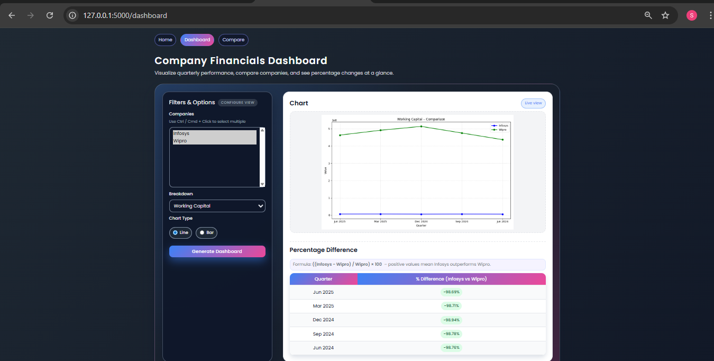
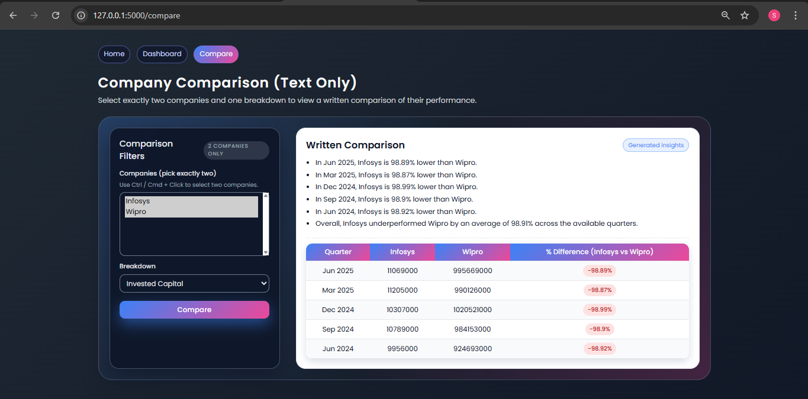
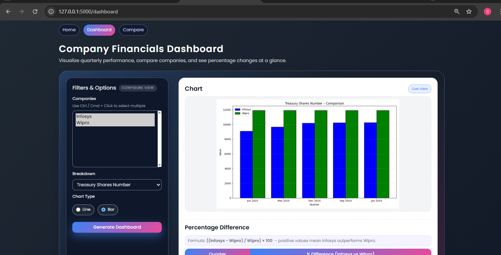

# Financial Dashboard Web Application

This is a multi-page Flask web application used to visualize company financial data, compare two companies, and generate written insights based on quarterly performance. The data is stored in a MySQL database and charts are generated using Matplotlib.

## Project Structure

financial_dashboard/
│
├── app.py
├── README.md
├── requirements.txt
│
├── templates/
│   ├── home.html
│   ├── index.html
│   ├── compare.html
│
├── static/
│   ├── chart.png
│
└── screenshots/
├── home.png
├── dashboard.png
└── compare.png

## Features

1. Home Page
   A simple welcome page with navigation to other parts of the application.

2. Dashboard Page (/dashboard)
   Allows selecting multiple companies, selecting a breakdown, and choosing a chart type (line or bar).
   Generates charts dynamically using Matplotlib.
   Shows percentage differences when exactly two companies are selected.

3. Compare Page (/compare)
   This page does not show any charts.
   It displays written insights comparing two companies across multiple quarters.
   Shows a table with values and percentage differences.

## Database Information

The application uses MySQL.
Database configuration:

host: localhost
user: root
password: abc
database: northwind

Main table used: financials_company

Required columns:
company_name
breakdown
q1_2025
q4_2024
q3_2024
q2_2024
q1_2024

## Installation and Setup

1. Clone the repository

git clone [https://github.com/sahithyaarjun/financial-dashboard.git](https://github.com/sahithyaarjun/financial-dashboard.git)
cd financial-dashboard

2. Install dependencies

pip install flask mysql-connector-python matplotlib

3. Run the application

python app.py

4. Open in your browser

[http://127.0.0.1:5000/](http://127.0.0.1:5000/)

## Screenshots

Add your screenshot files inside the screenshots folder.

Example usage in README:

## Future Enhancements

Possible improvements:

Add user authentication
Add export to PDF or Excel
Deploy on a cloud platform
Add more financial metrics
Improve UI with additional themes

## Credits

Developed by Sahithya Arjun
Flask application using MySQL and Matplotlib.

